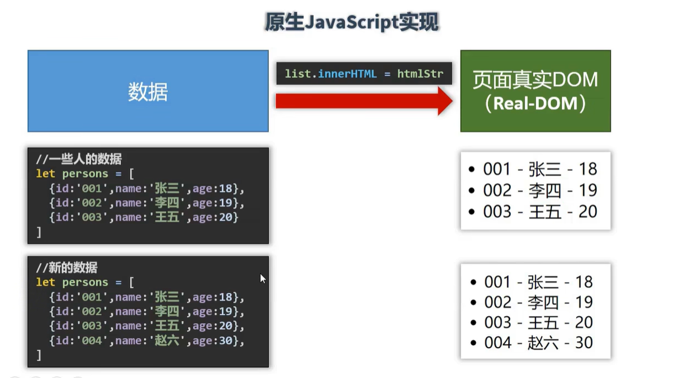
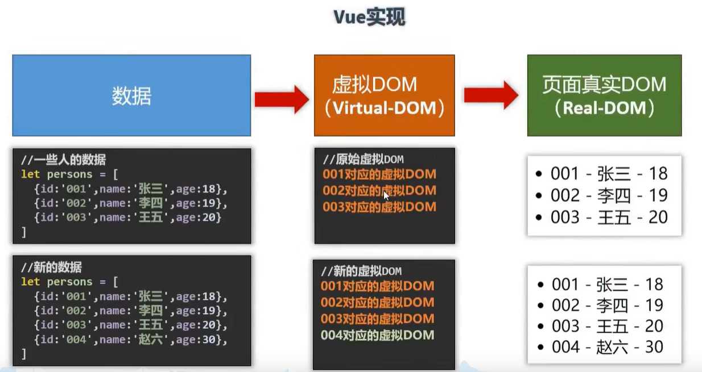

# Vue学习笔记

## 1、Vue简介

一套用于构建用户界面的渐进式JavaScript框架(将后台拿到的数据友好、美观的呈现再界面上)

### Vue的特点

1. #### 采用组件化模式，提高代码复用率且让代码更好维护。

2. #### 声明式编码，让编码人员无需直接操作DOM，提高开发效率。

   ```javascript
   //传统命令式编码，直接用JS操作DOM模型，根据JS代码一步一步执行
   //准备html字符串
   let htmlStr = ''
   //遍历数据拼接html字符串
   persons.forEach(p => {
       htmlStr += `<li>${p.id} - ${p.name} - ${p.age}</li>`
   });
   //获取list元素
   let list = document.getElementById('list')
   //修改内容(亲自操作DOM)
   list.innerHTML = htmlStr
   ```

   ```vue
   //声明式编码,声明数据的变量后直接再HTML标记中引用即可,无需对DOM模型进行操作
   <ul id="list">
    <li v-for="p in persons">
     {{p.id}} - {{p.name}} - {{p.age}}
    </li>
   </ul>
   ```

   

   

3. #### 使用虚拟DOM+优秀的Diff算法，尽量复用DOM节点。

   原生DOM只要数据一有变化则会直接更改整个DOM模型，而虚拟DOM则是先将数据整合成一个虚拟的DOM，再根据这个虚拟的DOM去建立真实DOM，一单数据发生改变，则比对虚拟DOM上变化的部分，然后只改动真实DOM上对应的部分。


### 学习Vue之前要掌握的JavaScript基础知识

- ES6语法规范
- ES6模块化
- 包管理
- 原型、原型链
- 数组常用方法
- axios
- promise等

## 2、Vue简单的开发环境(仅学习用)

Vue的搭建环境有两种，一种为<script>引入，另一种为vue-cli脚手架，<script>引入较为简单但是功能也相对较少，基本只能用于vue新手的学习，而vue-cli脚手架是在日常工作中建立项目时用的最多的且功能较多，这个后面创建项目案例时会讲到，在这个只讲用<script>引入的方法。

在Vue官网中下载Vue.js文件(有两个版本，开发版本包含完整的警告和调试模式，生产版本删除了警告),新建一个html文件并引入即可。

在html超文本标记中添加一个div容器并设置他的的id或者class(建议用id，因为如果用class的话当出现两个同class name的vue只会渲染第一个)，在JS中创建一个Vue实例即可(Vue实例格式固定，且必须有属性el用于指定为哪个容器服务,容器和Vue实例是一一对应的)

```html
<!DOCTYPE html>
<html lang="en">
<head>
    <meta charset="UTF-8">
    <meta http-equiv="X-UA-Compatible" content="IE=edge">
    <meta name="viewport" content="width=device-width, initial-scale=1.0">
    <title>Document</title>
    <!-- 引入Vue -->
    <script type="text/javascript" src="../js/vue.js"></script>
    <link rel="icon" href="../电脑.ico">
</head>
<body>
    <div id = "root">
        <h1>Hello {{name}}</h1>
        <h2>年龄： {{age}}</h2>
    </div>

    <script type="text/javascript">
        Vue.config.productionTip = false//阻止Vue在启动时生产生产提示
    
        //创建Vue实例
        const x = new Vue({
            el : '#root',//el用于指定当前Vue实例为哪个容器服务,值通常为css选择器字符串（一般用id,也可用class）,或者用表达式document.getElementById('root')也一样
            data: {//data用于存储数据，数据供el中的容器所使用
                name: '吴思源',
                age: '18'
            }
        })
    </script>
</body>
</html>
```

## 3、模板语法

 在root容器里的代码必须符合HTML规范，而且混入了一些特殊的Vue自己的语法

root容器里的代码被称为[Vue模板]

### 插值语法

 可以将Vue实例的data属性内的数据运用到Vue模板中，data中的数据一旦改变，对应虚拟DOM里data的数据也随之改变，之后更新DOM，数据实施的更新在页面上

可以为js表达式或者js代码(语句)

1、表达式: 一个表达式会生成一个值，可以放在任何一个需要值的地方

- a
- a+b
- function()
- x === y ? a : b

2、js代码

- if(){}
- for(){}

如果需要直接显示在容器内的(在超文本标记外),需要用两个{}包裹

```html
<div id = "root">
        <h1>Hello {{name}}</h1>
        <h2>年龄： {{age}}</h2>
        <h3>身高:  {{50 + 120}}cm</h3>
    </div>

    <script type="text/javascript">
        Vue.config.productionTip = false//阻止Vue在启动时生产生产提示
    
        //创建Vue实例
        const x = new Vue({
            el : '#root',//el用于指定当前Vue实例为哪个容器服务,值通常为css选择器字符串（一般用id,也可用class）,或者用表达式document.getElementById('root')也一样
            data: {//data用于存储数据，数据供el中的容器所使用
                name: '吴思源',
                age: '18'
            }
        })
    </script>
```

### 指令语法
